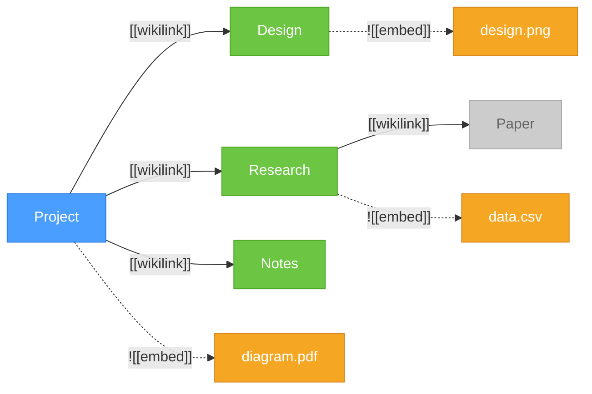
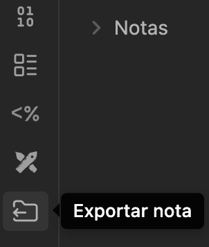
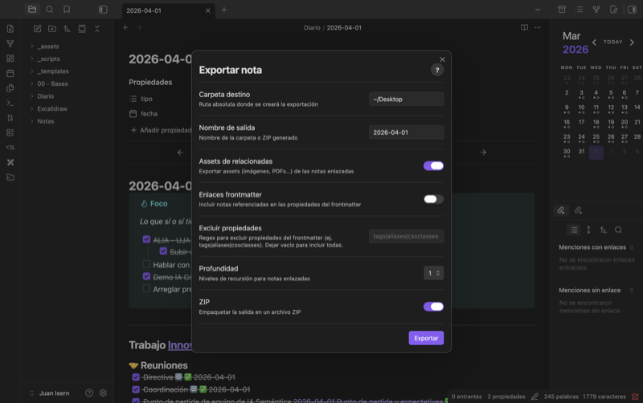

# Obsidian Note Bundler

Bundle your Obsidian notes with their linked notes and attachments into a portable folder or ZIP. The plugin walks your vault's **link graph** starting from the selected note, collecting every connected note and asset along the way.

## How it works



> With **depth 1**, the bundle includes Project + Design, Research, Notes and their assets. Paper (depth 2) is only reached if you increase the depth setting.

## Screenshots

| Ribbon icon | Export modal |
|:-----------:|:------------:|
|  |  |

## Features

- **Bundle active note** with all linked notes and embedded assets
- **Context menu** support — right-click a note (or multiple notes) in the file explorer
- **Batch bundle** — select multiple notes and bundle them all at once
- **Recursive bundling** — follow links up to 3 levels deep
- **Frontmatter links** — optionally include notes referenced in YAML frontmatter fields
- **ZIP output** — package everything into a single `.zip` file
- **Multi-language** — English and Spanish, auto-detected from Obsidian settings
- **Help button** — in-modal `?` button explaining every option
- **Summary modal** — post-export summary with file counts, missing references, and "Open folder" button
- **Ribbon icon** — quick access from the sidebar

## Installation

### From GitHub Releases

1. Go to [Releases](https://github.com/juanisernghosn/obsidian-note-bundler/releases)
2. Download `main.js` and `manifest.json` from the latest release
3. In your vault, create the folder `.obsidian/plugins/obsidian-note-bundler/`
4. Copy both files into that folder
5. Restart Obsidian (or reload: `Cmd+R` / `Ctrl+R`)
6. Go to Settings > Community plugins, find **Note Bundler** and enable it

### From Source

```bash
git clone https://github.com/juanisernghosn/obsidian-note-bundler.git
cd obsidian-note-bundler
npm install
npm run build
```

Then copy `main.js` and `manifest.json` to your vault:

```bash
cp main.js manifest.json /path/to/your-vault/.obsidian/plugins/obsidian-note-bundler/
```

## Usage

### Command Palette

`Cmd/Ctrl + P` > **Export Note**

### Context Menu

Right-click any `.md` file in the file explorer > **Export Note**

### Multiple Notes

Select multiple files > right-click > **Export Notes (N)**

### Options

| Option | Default | Description |
| ------ | ------- | ----------- |
| Output folder | `~/Desktop` | Absolute path for the export |
| Output name | Note name | Name of the folder/ZIP |
| Related assets | ON | Include assets from linked notes |
| Frontmatter links | OFF | Include notes referenced in any frontmatter property |
| Exclude properties | *(empty)* | Regex to skip frontmatter properties (e.g. `tags\|aliases\|cssclasses`) |
| Backlinks | OFF | Include notes that link *to* the exported note(s) — expands traversal in both directions |
| Depth | 1 | Recursion depth (1-3) |
| ZIP | OFF | Package as `.zip` instead of folder |

All options can also be configured in Settings > Note Bundler.

## Bundle Structure

```text
NoteName/
├── NoteName.md              # Base note
├── _assets/                 # Attachments from the base note
│   ├── image.png
│   └── document.pdf
└── _related/                # Linked notes
    ├── LinkedNote1.md
    ├── LinkedNote2.md
    └── _assets/             # Attachments from linked notes
        └── diagram.svg
```

## Roadmap

- [x] ~~**Backlinks** — include notes that link *to* the bundled note(s), not just outgoing links~~
- [x] ~~**Cross-platform ZIP** — use a JS-based ZIP library instead of macOS `zip` CLI~~
- [ ] **Dataview queries** — extract note references from `dataview` / `dataviewjs` blocks
- [ ] **Canvas support** — bundle `.canvas` files and the notes they contain
- [ ] **Configurable folder structure** — let users customize `_related/` and `_assets/` names
- [ ] **Export templates** — transform note content during export (strip frontmatter, rewrite links, etc.)

## Requirements

- Obsidian v0.15.0+
- Desktop only (uses Node.js `fs` for writing outside the vault)

## Author

**Juan Isern** — [jisern.rocks](https://jisern.rocks)

## License

[MIT](LICENSE)
